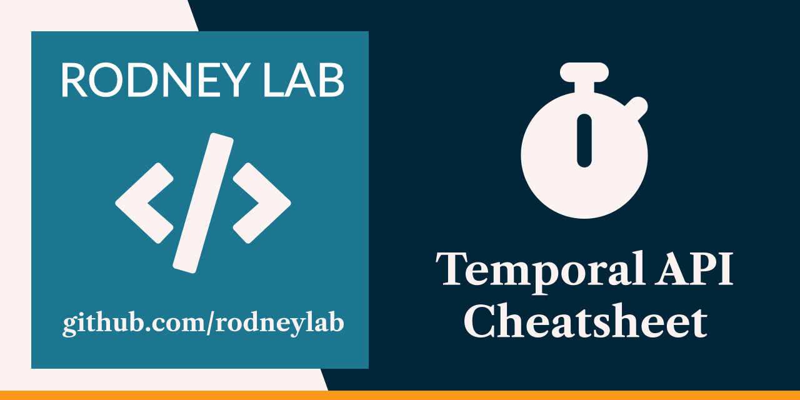

  

<h1 align="center">
  Temporal API Cheatsheet
</h1>

# temporal-api-cheatsheet

Code for the Temporal API Cheatsheet. See the Rodney Lab <a aria-label="Open Rodney Lab blog post on Svelte Kit Shiki syntax highlighting" href="https://rodneylab.com/sveltekit-shiki-syntax-highlighting/">article introducing the Temporal API Cheatsheet</a> for more colour. If you have any questions, please drop a comment at the bottom of that page. Feel free to submit a pull request for missing methods which you find handy.

Also feel free to jump into the [Rodney Lab matrix chat room](https://matrix.to/#/%23rodney:matrix.org).
